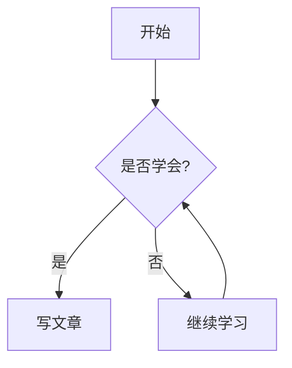

# 你好，世界！👋

欢迎来到我的博客！这是我的第一篇文章，也是一个**示例模板**，展示了 Firefly 主题支持的各种写作功能。你可以直接复制这份 frontmatter 和正文，改成你自己的内容。

## 📝 Frontmatter 说明

文章开头的 `---` 之间是 frontmatter（配置区），我这份用了这些字段：

| 字段 | 值 | 说明 |
|---|---|---|
| `title` | 你好，世界！ | 文章标题（必填） |
| `published` | 2026-08-15 10:00:00 | 发布时间（必填） |
| `description` | 我的第一篇博客… | 简介，列表卡片显示 |
| `tags` | 随笔 / 教程 / 博客 | 标签 |
| `category` | 随笔 | 分类 |
| `pinned` | true | 置顶 |

## 🎨 富文本功能演示

### 标题与强调

这是**加粗**、*斜体*、~~删除线~~、`行内代码`。

### 引用

> 这是引用块，引用一些有深度的句子。
> 路虽远，行则将至。

### 列表

- 无序列表项一
- 无序列表项二
  - 嵌套项

1. 有序列表一
2. 有序列表二

### 提醒框（Admonition）

> [!NOTE]
> 这是一个普通提示。

> [!TIP]
> 这是一个小技巧。

> [!WARNING]
> 这是一个警告。

> [!DANGER]
> 这是一个危险提示。

### 代码块

```python
def hello():
    print("你好，世界！")
    return 42
```

### 表格

| 功能 | 支持情况 |
|---|---|
| 代码高亮 | ✅ |
| Mermaid 图表 | ✅ |
| KaTeX 公式 | ✅ |
| 图片 | ✅ |

### 数学公式（KaTeX）

行内公式：$E = mc^2$

块级公式：

$$
\int_0^\infty e^{-x^2} dx = \frac{\sqrt{\pi}}{2}
$$

### Mermaid 图表



---

## ✍️ 下一步

- 复制这份文件的 frontmatter，改成你自己的标题和内容
- 需要封面图就加一行 `image: "/assets/images/xxx.webp"`
- 想加密就加 `password` 和 `passwordHint`

写完后 `git push`，文章就会发布到你网站上了。祝写作愉快！🚀
